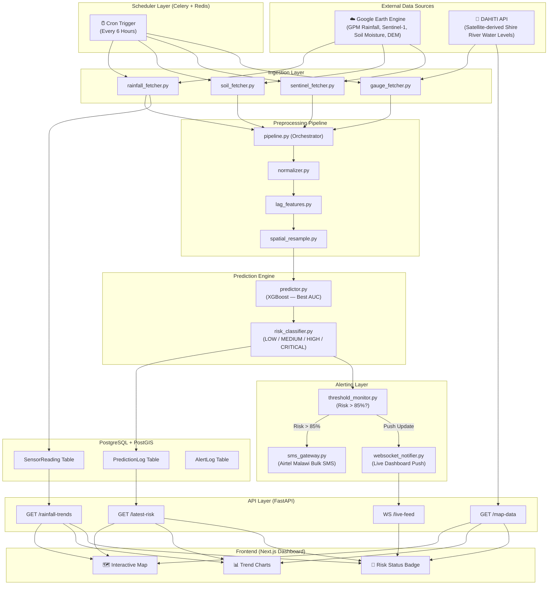

# Chikwawa Flood Prediction System — Backend Architecture

## Overview

The backend is a **Python-first** system built on **FastAPI**. It is responsible for three core responsibilities:
1. **Ingesting** live satellite and hydrological data from external sources.
2. **Predicting** flood risk by running incoming data through the trained ML models.
3. **Serving** processed results to the frontend dashboard and the alerting system.

The system follows a **Pipeline Architecture**, where data flows in one direction through clearly separated layers before reaching the end user.

---

## Folder Architecture

```
chikwawa-backend/
│
├── app/                          # Core FastAPI application
│   ├── main.py                   # App entry point, mounts all routers
│   ├── config.py                 # Loads environment variables (API keys, DB URLs)
│   ├── dependencies.py           # Shared FastAPI dependency injections (DB session, auth)
│   │
│   ├── api/                      # All HTTP & WebSocket route definitions
│   │   ├── v1/
│   │   │   ├── routes_risk.py        # GET /latest-risk, GET /risk-history
│   │   │   ├── routes_map.py         # GET /map-data (GeoJSON)
│   │   │   ├── routes_charts.py      # GET /rainfall-trends, GET /river-levels
│   │   │   ├── routes_alerts.py      # GET /alerts, POST /alert-subscribe
│   │   │   └── routes_websocket.py   # WS /live-feed (real-time push)
│   │
│   ├── core/                     # Business logic layer
│   │   ├── ingestion/            # Data ingestion orchestrators
│   │   │   ├── gee_client.py         # Google Earth Engine API connector
│   │   │   ├── rainfall_fetcher.py   # Pulls GPM rainfall data from GEE
│   │   │   ├── soil_fetcher.py       # Pulls SMAP soil moisture from GEE
│   │   │   ├── sentinel_fetcher.py   # Pulls Sentinel-1 SAR flood extent from GEE
│   │   │   └── gauge_fetcher.py      # Pulls Shire River gauge data from DWR
│   │   │
│   │   ├── preprocessing/        # Feature engineering pipeline
│   │   │   ├── normalizer.py         # Min-Max and Standard Scaling
│   │   │   ├── lag_features.py       # Creates 3-day, 7-day lagged rainfall columns
│   │   │   ├── spatial_resample.py   # Aligns all data layers to 1km grid resolution
│   │   │   └── pipeline.py           # Master orchestrator that runs all steps in order
│   │   │
│   │   ├── prediction/           # ML model layer
│   │   │   ├── model_loader.py       # Loads serialized .joblib models from disk
│   │   │   ├── predictor.py          # Runs features through the model, returns risk %
│   │   │   └── risk_classifier.py    # Converts raw probability into LOW/MEDIUM/HIGH/CRITICAL
│   │   │
│   │   └── alerting/             # Alert trigger and dispatch layer
│   │       ├── threshold_monitor.py  # Watches predictions; fires if risk > 85%
│   │       ├── sms_gateway.py        # Integrates Twilio / local Malawi SMS provider
│   │       └── websocket_notifier.py # Pushes alerts to connected dashboard clients
│   │
│   ├── db/                       # Database layer
│   │   ├── database.py           # SQLAlchemy engine and session factory
│   │   ├── models/               # ORM table definitions
│   │   │   ├── PredictionLog.py      # Stores each prediction run and its output
│   │   │   ├── AlertLog.py           # Records every alert sent and to whom
│   │   │   ├── SensorReading.py      # Raw ingested readings (rainfall, river level)
│   │   │   └── Subscriber.py         # Phone numbers / contacts registered for alerts
│   │   └── crud/                 # Database read/write operations
│   │       ├── crud_predictions.py
│   │       ├── crud_alerts.py
│   │       └── crud_sensors.py
│   │
│   └── schemas/                  # Pydantic request/response data shapes
│       ├── risk_schema.py            # Shape of a /latest-risk response
│       ├── alert_schema.py           # Shape of an alert payload
│       └── sensor_schema.py          # Shape of a raw sensor reading
│
├── scheduler/                    # Automated background task runner
│   ├── celery_app.py             # [See: "What is Celery?" section below]
│   └── tasks/                    # [See: "What are Tasks?" section below]
│       ├── task_ingest.py            # Scheduled: fetch new data every 6 hours
│       ├── task_predict.py           # Scheduled: run prediction cycle after ingestion
│       └── task_cleanup.py           # Scheduled: archive old readings weekly
│
├── models/                       # Serialized ML model files (binary, using Pickle)
│   ├── xgb_flood_model.pkl           # PRIMARY: Trained XGBoost model (best AUC)
│   └── scaler.pkl                    # Fitted scaler (must match training preprocessing)
│
│   > NOTE: Pickle (.pkl) is used instead of joblib because it is natively
│   > supported by Python with no extra dependencies, and is consistent
│   > with how the model was saved from the training notebooks.
│
├── geospatial/                   # Static geographic reference files
│   ├── chikwawa_boundaries.geojson   # District and TA boundary polygons
│   ├── shire_river.geojson           # River centreline for map rendering
│   └── dem_chikwawa_90m.tif          # Digital Elevation Model (SRTM)
│
├── tests/                        # Automated test suite
│   ├── test_ingestion.py             # [See: "What is the Tests folder?" section below]
│   ├── test_preprocessing.py
│   ├── test_predictor.py
│   └── test_api_endpoints.py
│
├── Dockerfile                    # Container build definition
├── docker-compose.yml            # Orchestrates app + database + redis containers
├── .env.example                  # Template for required environment variables
└── requirements.txt              # Python dependencies
```

---

## Data Movement & Flow Diagram

Data in this system flows strictly in **one direction** — from external satellite sources through a series of transformation layers before reaching the end user. There are no circular data flows and no layer that writes back upstream. Here is the high-level movement:

1. **GEE + DAHITI → Ingestion Layer**: Every 6 hours, Celery wakes up and triggers the fetcher modules. Each fetcher makes an API call to its respective source and writes raw values to the `SensorReading` table.
2. **SensorReading → Preprocessing Pipeline**: `pipeline.py` reads the latest raw records, computes derived features (`topographic_wet_index`, lag rainfall totals, etc.), normalizes all values using `scaler.pkl`, and returns a clean feature DataFrame.
3. **Feature DataFrame → Prediction Engine**: The 9-column DataFrame is passed to `xgb_flood_model.pkl`. The model outputs a flood probability per grid cell, which is classified and written to `PredictionLog`.
4. **PredictionLog → Alerting Layer**: `threshold_monitor.py` reads the latest prediction. If any cell exceeds 85% probability, it triggers simultaneous SMS dispatch (Airtel Malawi) and a WebSocket broadcast to the dashboard.
5. **PredictionLog + SensorReading → API Layer**: The FastAPI endpoints serve pre-computed results from the database on-demand. No heavy computation happens during an API request — all processing was done in advance by the scheduler.

---

## Explanatory Notes (Addressing Your Questions)

### 🔵 How is `SensorReading` data actually collected?
The `SensorReading` table does **not** have someone manually entering data. Here is the exact automated collection mechanism:

| Feature | Source | How It Is Fetched |
| :--- | :--- | :--- |
| `Rainfall_mm` | GPM Satellite via **Google Earth Engine API** | `rainfall_fetcher.py` sends an API call to GEE every 6 hours. GEE returns the exact millimetres of rain that fell over Chikwawa's bounding box in that period. |
| `Dist_River_m` | Pre-calculated from GEE + DEM | Computed once from the river centreline GeoJSON and the elevation model. Stored as a static column — it doesn't change with time. |
| `Elevation_m` | SRTM DEM via GEE | Fetched once during setup. Static per grid cell. |
| `Slope_deg` | Derived from SRTM DEM | Calculated from the DEM using `spatial_resample.py`. Static. |
| `NDVI` | Sentinel-2 via GEE | `sentinel_fetcher.py` pulls the latest vegetation index image. Updated weekly or per-event. |
| `Soil Moisture / PS_codes` | SMAP Satellite via GEE | `soil_fetcher.py` pulls soil saturation values from GEE. Updated daily. |

The **Shire River gauge level** is the only feature that comes from a human-maintained station (Malawi DWR). All fetched values are immediately written to the `SensorReading` table, which acts as a **raw data log** before processing.

#### 🔎 DWR Data Accessibility Assessment

> [!WARNING]
> After research, it has been confirmed that **the Malawi DWR does NOT have a public, real-time API** for river gauge data. The official website exists but data access requires a formal institutional request — it is not openly queryable by a script.

**Official Site:**
- 🌐 Ministry of Water & Sanitation: [https://water.gov.mw](https://water.gov.mw)
- For research data access, a formal written request must be submitted through this portal or directly to the department. Given your project is a university submission supervised by Dr. Chimango Nyasulu, this institutional channel is the most viable path.

**Verdict: The DWR route is NOT suitable for automated live ingestion.** 
Here is why and what we use instead:

| Option | Site / Link | Accessibility | Suitability |
| :--- | :--- | :--- | :--- |
| **Malawi DWR (gauge data)** | [water.gov.mw](https://water.gov.mw) | ❌ No public API. Formal request required. | Not suitable for automation |
| **GRDC (Global Runoff Data Centre)** | [bafg.de/GRDC](https://www.bafg.de/GRDC/EN/02_dtprtl/dtprtl_node.html) | ⚠️ Some Malawi stations available. Registration needed. | Good for historical validation only |
| **DAHITI (Satellite Water Levels)** | [dahiti.dgfi.tum.de](https://dahiti.dgfi.tum.de) | ✅ Free registration. Satellite-derived Shire River levels available. | **Best alternative for live water level data** |
| **MASDAP (Malawi Spatial Data Portal)** | [masdap.mw](http://www.masdap.mw) | ✅ Publicly accessible. Spatial/environmental datasets. | Good for static reference layers |
| **HDX (Humanitarian Data Exchange)** | [data.humdata.org](https://data.humdata.org) | ✅ Fully open. Rainfall and climate data for Malawi available. | Good supplementary source |

#### ✅ Recommended Strategy: Use DAHITI as the Shire River data source
**DAHITI** uses satellite altimetry (from ESA's Sentinel-3 and NASA/CNES satellites) to derive water surface elevation for rivers worldwide — including the Shire River. It is:
- Freely accessible after a simple registration
- Updated regularly from satellite passes
- Programmatically accessible via their API (HTTP GET requests)

This means `gauge_fetcher.py` will be updated to call the **DAHITI API** instead of a DWR endpoint. This is a more reliable and automatable solution than depending on a government office's internal data.

---

### 🔵 What is the `tests/` folder for?
Think of the `tests/` folder as a **quality control checkpoint** for the system. It is a collection of automated scripts that verify the backend is working correctly before it is deployed.

Here is what each test file does in plain English:

| File | What it Checks |
| :--- | :--- |
| `test_ingestion.py` | *"Does the GEE connection actually return rainfall data for Chikwawa? Is it a valid number?"* |
| `test_preprocessing.py` | *"After the pipeline runs, does the output have exactly 9 columns (the right features)? Are there any unexpected null values?"* |
| `test_predictor.py` | *"If I feed the model a sample with very high rainfall and low elevation, does it return a HIGH risk score?"* |
| `test_api_endpoints.py` | *"Does `GET /latest-risk` actually return data? Does it return the correct JSON structure?"* |

Without these, a silent bug (e.g., a column name mismatch between training and live data) could cause the model to predict wrong results with no error message. These tests catch that.

---

### 🔵 What is Celery (`celery_app.py`)?
**Celery** is a task queue system — think of it as an **automated job manager** for the backend.

Without Celery, your FastAPI server would have to manually trigger ingestion itself, which is unreliable and would freeze the API while fetching data. Instead:
- Celery runs **separately** from FastAPI in the background.
- It connects to a **Redis** server (a fast in-memory message broker) which acts like a shared whiteboard between Celery and FastAPI.
- `celery_app.py` simply configures this connection: *"Here is where Redis is. Here is where my tasks live. Run them on this schedule."*

In practice, Celery is what ensures that at 06:00 AM every morning, the data ingestion runs automatically — even if no user is on the dashboard.

---

### 🔵 What are the `tasks/` files?
These are the **actual jobs** that Celery executes on a schedule:

| File | When It Runs | What It Does |
| :--- | :--- | :--- |
| `task_ingest.py` | Every 6 hours | Calls all the fetcher modules to download fresh satellite and gauge data. Saves raw readings to the database. |
| `task_predict.py` | Immediately after ingestion | Runs the preprocessing pipeline and then the XGBoost model on the new data. Saves the prediction result. Triggers alerts if risk is HIGH. |
| `task_cleanup.py` | Once per week (e.g., Sunday midnight) | Archives old raw `SensorReading` records to keep the database from growing too large over time. |

Think of them as **scheduled alarm clocks**, each with a specific job attached.

---

## Input Features (From Training Data)

The system ingests and processes exactly **9 features** (the `Flood` column is the target/label and is **excluded** from all live ingestion):

| Feature | Type | Source |
| :--- | :--- | :--- |
| `Elevation_m` | Static | SRTM DEM via GEE |
| `Slope_deg` | Static | Derived from DEM |
| `NDVI` | Dynamic (weekly) | Sentinel-2 via GEE |
| `Rainfall_mm` | Dynamic (6-hourly) | GPM via GEE |
| `Dist_River_m` | Static | Pre-computed from river GeoJSON + DEM |
| `topographic_wet_index` | Static | Computed from DEM (as per EDA notebook) |
| `elevation_to_river` | Static | Elevation difference to nearest river cell |
| `LC_codes` | Semi-static (annual) | Land cover classification via GEE |
| `PS_codes` | Dynamic (daily) | Soil saturation / SMAP via GEE |

> [!CAUTION]
> The `Flood` column **must never be included** in the live ingestion pipeline. It is the prediction target — the system outputs this value; it does not receive it as input.

---

## Preprocessing Pipeline (Aligned to EDA Notebook)

The preprocessing pipeline in `app/core/preprocessing/pipeline.py` follows the **exact same sequence** as your `06_combined_eda_and_preprocessing.ipynb` notebook:

| Step | Module | Action (Matching Notebook) |
| :--- | :--- | :--- |
| 1 | `spatial_resample.py` | Snap all GEE raster layers to the same 1 km grid so features align spatially |
| 2 | `pipeline.py` | Compute `topographic_wet_index` from elevation and slope (TWI formula from notebook) |
| 3 | `pipeline.py` | Compute `elevation_to_river` as the elevation difference between each grid cell and the nearest river pixel |
| 4 | `pipeline.py` | Assign `LC_codes` from the land cover classification layer (categorical encoding matching training) |
| 5 | `lag_features.py` | Create 3-day and 7-day rolling rainfall totals as additional columns *(see importance note below)* |
| 6 | `normalizer.py` | Apply the saved `scaler.pkl` (must be the **exact same scaler** fitted during training) |
| 7 | `pipeline.py` | Drop any rows with null values; validate that all 9 feature columns are present before prediction |

#### 🔵 Why are the 3-day and 7-day Rolling Rainfall Totals Important?

This is one of the most **critical** steps in the entire pipeline. Here is the intuition:

Floodwaters in Chikwawa do not appear instantly from a single rainstorm. The land must first become **saturated** over several days before surface water has nowhere to go and flooding begins. A single reading of today's rainfall of say 40mm may look harmless on its own. But if it follows 6 consecutive days of 30mm+ rainfall, the soil is already full and even moderate rain becomes catastrophic.

`lag_features.py` solves this by looking back at the `SensorReading` table in the database and computing accumulated totals:

| Lag Column Created | What It Represents | Why It Matters |
| :--- | :--- | :--- |
| `Rainfall_3day_sum` | Total mm of rain over the past 72 hours | Captures short-term soil saturation buildup |
| `Rainfall_7day_sum` | Total mm of rain over the past 7 days | Captures week-long wet season accumulation — the main driver of Shire River level rises |

---

#### 🔵 How Exactly Are the Lag Features Fed Into the Model During Prediction?

> [!CAUTION]
> **The Golden Rule**: The XGBoost model can only accept the **exact same columns it was trained on** — nothing more, nothing less. If you feed it 11 columns when it was trained on 9, it will either throw an error or silently produce wrong predictions.

This creates a strict two-path design decision for how lag features are handled:

---

**PATH A — Confirmed Design (Your Approved Approach)**

This is the exact approach adopted for the current deployment. The model remains unchanged and still receives exactly 9 columns:

```
Step 1: Fetch live 6-hour data → raw values for all 9 features from GEE/DAHITI

Step 2: lag_features.py reads the last 7 days of Rainfall_mm
        from the SensorReading table and computes:
        → Rainfall_7day_sum  (preferred — if 7 days of history exist)
        → Rainfall_3day_sum  (fallback — used if fewer than 7 days in DB)

Step 3: The Rainfall_mm slot in the feature vector is REPLACED
        directly with Rainfall_7day_sum (or 3-day if history is short)
        → All other 8 features stay exactly as-is
        → The column name remains "Rainfall_mm" — the value changes

Step 4: 9-column vector assembled ✅ (same column names as training)

Step 5: scaler.pkl normalizes the 9 columns ✅
        (scaler was fitted on Rainfall_mm values — the range is compatible
        since accumulated rainfall and single-event rainfall share the same unit: mm)

Step 6: xgb_flood_model.pkl receives exactly what it expects ✅

Step 7: Outputs probability score (e.g., 0.91 = 91% flood risk)
        → risk_classifier.py maps this to LOW / MEDIUM / HIGH / CRITICAL
```

> [!NOTE]
> **Why this works cleanly**: By substituting `Rainfall_mm` with its accumulated 7-day total, the model sees a value that represents the cumulative rainfall burden on the landscape rather than a single 6-hour snapshot. The model was trained on `Rainfall_mm` values that already captured seasonal patterns — so feeding it accumulated totals makes the signal **stronger and more predictive** without violating the 9-column contract.

> [!CAUTION]
> **Scaler compatibility**: The `scaler.pkl` was fitted on the original `Rainfall_mm` training values. Since `Rainfall_7day_sum` will naturally be a larger number (e.g., 7× a single reading), `normalizer.py` must **re-fit or clip** the scaler range for the `Rainfall_mm` column, OR the scaler must have been fitted on accumulated values from the start. This must be verified before deployment.

---

**PATH B — Lag Features As Direct Model Inputs (Future Improvement)**

This is the recommended long-term upgrade for when the model is next retrained:

```
Step 1: Go back to FLOOD_PREDICTION.ipynb
Step 2: Add Rainfall_3day_sum and Rainfall_7day_sum as new columns to training data
Step 3: Retrain XGBoost on 11 features (9 original + 2 lag columns)
Step 4: Save new xgb_flood_model_v2.pkl and new scaler_v2.pkl
Step 5: Live pipeline now assembles all 11 columns before calling the model
Step 6: Model produces more accurate predictions because it directly learns
        the flood-accumulation relationship from the training data
```

---

**Final Feature Vector Assembly (Path A — Current Implementation)**

Here is exactly how `pipeline.py` builds the single prediction row:

| Column | Source at Prediction Time | Notes |
| :--- | :--- | :--- |
| `Elevation_m` | Static — SRTM DEM via GEE, stored in DB | Unchanged |
| `Slope_deg` | Static — derived from DEM, stored in DB | Unchanged |
| `NDVI` | Dynamic — latest Sentinel-2 value from GEE | Unchanged |
| `Rainfall_mm` | **→ Replaced by `Rainfall_7day_sum`** (or 3-day fallback) | ⚠️ Value substituted |
| `Dist_River_m` | Static — pre-computed and stored in DB | Unchanged |
| `topographic_wet_index` | Static — computed from DEM, stored in DB | Unchanged |
| `elevation_to_river` | Static — computed from DEM, stored in DB | Unchanged |
| `LC_codes` | Semi-static — latest land cover class from GEE | Unchanged |
| `PS_codes` | Dynamic — latest SMAP soil moisture from GEE | Unchanged |

These 9 values are assembled into a **single-row Pandas DataFrame**, the `Rainfall_mm` column is substituted with the accumulated total, then `scaler.pkl` normalizes all 9 columns before passing to `xgb_flood_model.pkl.predict_proba()`.

> [!IMPORTANT]
> The `SensorReading` table must always retain at least the last **7 days** of `Rainfall_mm` records. If fewer than 7 days of history exist (e.g., the very first week of deployment), `lag_features.py` gracefully falls back to `Rainfall_3day_sum` rather than crashing.

> [!WARNING]
> The scaler MUST be loaded from `models/scaler.pkl` — it must be the same scaler fitted on the training data. Verify that the accumulated rainfall value range does not exceed the scaler's fitted max before going live.

```
Step 1: Fetch live data → raw values for all 9 features
Step 2: lag_features.py computes Rainfall_3day_sum and Rainfall_7day_sum from SensorReading history
Step 3: The lag values are used ONLY to ADJUST the Rainfall_mm input value
         → e.g., if 7-day sum > threshold, Rainfall_mm is weighted upward before scaling
Step 4: The final 9-column vector (same columns as training) is assembled
Step 5: scaler.pkl is applied to normalize the 9 columns
Step 6: The 9-column normalized vector is passed to xgb_flood_model.pkl
Step 7: Model outputs a probability score (e.g., 0.91 = 91% flood risk)
```

In this path, the lag features act as a **modifier/weight** on `Rainfall_mm` — they influence what value enters the model but never appear as separate columns.

---

**PATH B — Lag Features As Direct Model Inputs (Requires Retraining)**

This is the cleaner, more accurate long-term approach and should be adopted when the model is next retrained:

```
Step 1: Go back to FLOOD_PREDICTION.ipynb
Step 2: Add Rainfall_3day_sum and Rainfall_7day_sum as new columns to training data
Step 3: Retrain XGBoost on 11 features (9 original + 2 lag columns)
Step 4: Save new xgb_flood_model_v2.pkl and new scaler_v2.pkl
Step 5: Live pipeline now assembles all 11 columns before calling the model
Step 6: Model produces more accurate predictions because it now directly "sees" accumulation
```

---

**Final Feature Vector Assembly (Path A — Current Implementation)**

Here is exactly how `pipeline.py` builds the single row that goes into the model at prediction time:

| Column | Where It Comes From at Prediction Time |
| :--- | :--- |
| `Elevation_m` | Static — loaded once from SRTM DEM via GEE, stored in DB |
| `Slope_deg` | Static — derived from DEM, stored in DB |
| `NDVI` | Dynamic — latest Sentinel-2 value fetched from GEE |
| `Rainfall_mm` | Dynamic — latest 6-hour GPM value, **adjusted by lag weight** |
| `Dist_River_m` | Static — pre-computed and stored in DB |
| `topographic_wet_index` | Static — computed from DEM, stored in DB |
| `elevation_to_river` | Static — computed from DEM, stored in DB |
| `LC_codes` | Semi-static — latest land cover class from GEE |
| `PS_codes` | Dynamic — latest SMAP soil moisture from GEE |

These 9 values are combined into a **single-row Pandas DataFrame**, scaled using `scaler.pkl`, then passed directly to `xgb_flood_model.pkl.predict_proba()`. The output is a probability between 0 and 1, which `risk_classifier.py` then converts to LOW / MEDIUM / HIGH / CRITICAL.

> [!IMPORTANT]
> The `SensorReading` table must always retain at least the last **7 days** of `Rainfall_mm` records. If fewer than 7 days of history exist (e.g., on the very first week of deployment), `lag_features.py` must handle this gracefully by computing the lag over whatever history is available rather than crashing.

> [!WARNING]
> The scaler MUST be loaded from `models/scaler.pkl` — it must be the same scaler that was fitted on the training data. Using a newly fitted scaler on live data would produce incorrect normalized values and destroy model accuracy.

---

## Data Flow Diagram



> [!NOTE]
> The diagram above now reflects GEE as the source for all 9 model input features (excluding Flood). The DWR gauge feeds `Dist_River_m` / river levels for charts but these are **not** re-fed into the model — they are already baked into the static features.

---

## Core Backend Processes & Orchestration

### Process 1: The Automated Ingestion Cycle
**Trigger**: Celery scheduler fires every 6 hours (e.g., 06:00, 12:00, 18:00, 00:00 UTC).

| Step | Module | Action |
| :--- | :--- | :--- |
| 1 | `task_ingest.py` | Celery task initiates the pipeline run |
| 2 | `gee_client.py` | Authenticates with GEE using a Service Account |
| 3 | `rainfall_fetcher.py` | Downloads last 6-hour GPM rainfall for Chikwawa bounds |
| 4 | `soil_fetcher.py` | Downloads current SMAP soil moisture layer |
| 5 | `sentinel_fetcher.py` | Downloads latest Sentinel-1 SAR image (if available) |
| 6 | `gauge_fetcher.py` | Calls **DAHITI API** for satellite-derived Shire River water level (replaces DWR — no public API available) |
| 7 | `crud_sensors.py` | Saves all raw readings to `SensorReading` table |

### Process 2: The Preprocessing Pipeline
**Trigger**: Fires immediately after Ingestion is complete (chained Celery task).

| Step | Module | Action |
| :--- | :--- | :--- |
| 1 | `pipeline.py` | Loads the latest raw data from `SensorReading` table |
| 2 | `spatial_resample.py` | Snaps all satellite layers to the same 1km grid |
| 3 | `lag_features.py` | Calculates 3-day and 7-day rolling rainfall totals |
| 4 | `normalizer.py` | Applies the saved `scaler.pkl` to all numerical columns |
| 5 | `pipeline.py` | Returns a clean, model-ready feature DataFrame |

### Process 3: The Prediction Cycle
**Trigger**: Fires immediately after Preprocessing completes.

| Step | Module | Action |
| :--- | :--- | :--- |
| 1 | `model_loader.py` | Loads **`xgb_flood_model.pkl`** (XGBoost — best AUC) from disk using Python's `pickle` module |
| 2 | `predictor.py` | Feeds the 9-feature DataFrame into the model — outputs flood probability per grid cell |
| 3 | `risk_classifier.py` | Converts probability to human-readable: LOW / MEDIUM / HIGH / CRITICAL |
| 4 | `crud_predictions.py` | Saves the prediction result (timestamp, risk level, probability, grid) to `PredictionLog` |

### Process 4: Alert Orchestration
**Trigger**: Every time a new prediction is written to `PredictionLog`.

| Step | Module | Action |
| :--- | :--- | :--- |
| 1 | `threshold_monitor.py` | Checks if any grid cell's probability exceeds 85% |
| 2 (if YES) | `sms_gateway.py` | Fetches registered `Subscriber` records from DB and dispatches SMS via **Airtel Malawi Bulk SMS API** |
| 3 (if YES) | `websocket_notifier.py` | Broadcasts a "RISK_LEVEL_CHANGE" event to all active WebSocket clients |
| 4 | `crud_alerts.py` | Logs every alert dispatched to `AlertLog` table |

> [!NOTE]
> **Airtel Malawi** is used as the SMS provider instead of Twilio. This is the correct choice because:
> (1) It is significantly cheaper for Malawi-local numbers.
> (2) Delivery is more reliable on Malawian networks.
> (3) The Airtel Malawi Bulk SMS API supports HTTP POST requests — the `sms_gateway.py` module will call this endpoint with the phone number, message, and API key.

### Process 5: API Serving (On-Demand)
**Trigger**: Called by the frontend dashboard at page load or on a 5-minute polling interval.

| Endpoint | Module | Auth Required | Returns |
| :--- | :--- | :--- | :--- |
| `GET /latest-risk` | `routes_risk.py` | None | Latest prediction per TA, risk level, and timestamp |
| `GET /map-data` | `routes_map.py` | None | GeoJSON of Chikwawa boundaries with risk scores |
| `GET /rainfall-trends` | `routes_charts.py` | None | Time-series of rainfall + river levels |
| `WS /live-feed` | `routes_websocket.py` | None | Persistent connection for live risk pushes |
| `POST /auth/login` | `routes_auth.py` | None | Returns a **JWT Access Token** on valid credentials |
| `POST /auth/register`| `routes_auth.py` | **JWT (Admin)** | Creates a new admin/officer user account |
| `GET /alerts` | `routes_alerts.py` | **JWT (Bearer)** | Returns paginated history from `AlertLog` |
| `POST /alert-subscribe`| `routes_alerts.py`| **JWT (Bearer)** | Registers a new SMS subscriber |

---

## Authentication & Authorization

The system uses **JWT (JSON Web Tokens)** for securing administrative and write-access endpoints. This follows the **OAuth2 Password Flow** standard, allowing for granular control over who can manage alerts and users.

### Strategy: JWT with OAuth2 Password Bearer

| Endpoint | Access Level | Mechanism |
| :--- | :--- | :--- |
| Public Data | Public | No auth required |
| `POST /auth/login` | Public | Username/Password → returns `access_token` |
| Admin Operations | Admin/Officer | `Authorization: Bearer <JWT_TOKEN>` header |

### How It Works

1. **User Storage**: User credentials (hashed passwords) are stored in the `User` table.
2. **Authentication**: Admin/Officer users send their credentials to `/auth/login`.
3. **Token Issuance**: The server validates credentials and generates a JWT signed with `JWT_SECRET_KEY`.
4. **Authorization**: For protected routes (like `/alert-subscribe`), FastAPI's `OAuth2PasswordBearer` extracts the token from the header.
5. **Validation**: `app/core/auth.py` decodes the JWT, verifies the signature and expiration, and ensures the user exists.

> [!IMPORTANT]
> Passwords MUST be hashed using a secure algorithm like **bcrypt** before being stored in the database. Plaintext passwords are never stored.

---

---

## Error Handling & Retry Strategy

This system depends on external APIs (GEE, DAHITI) that can be unavailable due to network issues, rate limits, or scheduled maintenance. Without a retry strategy, a failed ingestion cycle would leave the model running on stale data — which is dangerous in a flood-risk context.

### Celery Retry Policy (applied in `task_ingest.py`)

| Scenario | Behaviour |
| :--- | :--- |
| GEE API returns a timeout or 5xx error | Celery automatically retries the task |
| **Retry schedule** | Attempt 1 → wait 60s → Attempt 2 → wait 300s → Attempt 3 → wait 900s (exponential backoff) |
| **Max retries** | 3 attempts before the task is marked as `FAILED` |
| **On final failure** | An alert is logged to `SystemLog`, and a `DataFreshnessAlert` flag is set in the DB so the dashboard can warn users |
| DAHITI API unavailable | `gauge_fetcher.py` logs the failure and the pipeline proceeds using the **last known river level** from the most recent `SensorReading` row |
| GEE returns partial data | `pipeline.py` validates that all 9 feature columns are non-null before calling the model. If any are null, the prediction cycle is **skipped** and the previous `PredictionLog` entry remains active |

### Data Freshness Warning

The `PredictionLog` table stores a `run_timestamp` with every record. The `GET /latest-risk` endpoint also returns this timestamp in its response. If the frontend detects that the last prediction is **more than 12 hours old**, it displays a **"Data may be stale — last update was X hours ago"** warning banner.

> [!IMPORTANT]
> The system must **never silently fail**. Every failed ingestion or prediction cycle must write a structured record to a `SystemLog` table (`timestamp`, `task_name`, `error_message`, `retry_count`) so that administrators can audit exactly what went wrong and when.

---

## Model Versioning

When the XGBoost model is retrained (e.g., after new flood events are added to the training dataset), the production system must be updated **without causing downtime** or serving predictions from a mismatched model/scaler pair.

### Versioned File Naming Strategy

```
models/
├── xgb_flood_model_v1.pkl     ← Original trained model (current production)
├── scaler_v1.pkl              ← Scaler fitted for v1
├── xgb_flood_model_v2.pkl     ← Newly retrained model (staged for testing)
├── scaler_v2.pkl              ← Scaler fitted for v2
└── active_model.txt           ← Contains exactly one line: "v1" or "v2"
```

### Zero-Downtime Update Process

| Step | Action |
| :--- | :--- |
| 1 | Retrain the model in `FLOOD_PREDICTION.ipynb`. Save as `xgb_flood_model_v2.pkl` and `scaler_v2.pkl`. |
| 2 | Run the full `tests/test_predictor.py` suite against v2. Confirm AUC is equal to or better than v1 before promoting. |
| 3 | Copy both `.pkl` files to the server's `models/` directory (alongside the existing v1 files). |
| 4 | Update `active_model.txt` to contain `v2`. |
| 5 | `model_loader.py` reads `active_model.txt` on **every prediction cycle** — it automatically loads v2 on the next scheduled Celery run. No server restart needed. |
| 6 | Monitor the first 3 prediction cycles from v2. If results are anomalous, revert `active_model.txt` to `v1` instantly. |

> [!TIP]
> The `MODEL_DIR` environment variable should point to the **directory**, not to a specific file. `model_loader.py` constructs the full filename dynamically from `MODEL_DIR + active_model.txt`. This avoids needing to change environment variables or restart any service when switching model versions.

---

## Database Schema (PostGIS)

| Table | Key Columns | Purpose |
| :--- | :--- | :--- |
| `User` | `id`, `username`, `hashed_password`, `role`, `is_active` | System administrators and district officers |
| `SensorReading` | `id`, `source`, `timestamp`, `value`, `geometry` | Raw incoming data from all sources |
| `PredictionLog` | `id`, `run_timestamp`, `grid_id`, `probability`, `risk_level` | Full history of all model outputs |
| `AlertLog` | `id`, `fired_at`, `risk_level`, `channel`, `recipient` | Audit trail of all alerts sent |
| `Subscriber` | `id`, `phone_number`, `ta_area`, `is_active` | Registered flood SMS alert recipients |

---

## Environment Variables Required

| Variable | Description |
| :--- | :--- |
| `GEE_SERVICE_ACCOUNT` | Google Earth Engine service account email |
| `GEE_PRIVATE_KEY_PATH` | Path to the GEE private key JSON file |
| `DATABASE_URL` | PostgreSQL + PostGIS connection string |
| `REDIS_URL` | Redis broker URL (for Celery task queue) |
| `AIRTEL_MALAWI_API_KEY` | Airtel Malawi Bulk SMS API key |
| `AIRTEL_MALAWI_SENDER_ID` | Registered sender name shown on recipient's phone (e.g., "FLOOD-ALERT") |
| `DAHITI_API_KEY` | DAHITI API key for satellite-derived Shire River water levels |
| `ALERT_THRESHOLD` | Risk probability threshold to trigger alerts (default: 0.85) |
| `MODEL_DIR` | Path to the `models/` directory — `model_loader.py` reads `active_model.txt` from here |
| `SCALER_PATH` | Path to `scaler.pkl` — must match the scaler used during training |
| `JWT_SECRET_KEY` | Long, random string used to sign JWT tokens |
| `JWT_ALGORITHM` | Algorithm used for JWT (default: "HS256") |
| `ACCESS_TOKEN_EXPIRE_MINUTES` | How long a JWT remains valid (e.g., 60) |

---

> [!TIP]
> **Where to start**: Begin by setting up `app/main.py`, `app/config.py`, and `app/db/database.py` to establish the application skeleton and database connection. Then implement the ingestion layer before wiring up the ML prediction pipeline.

